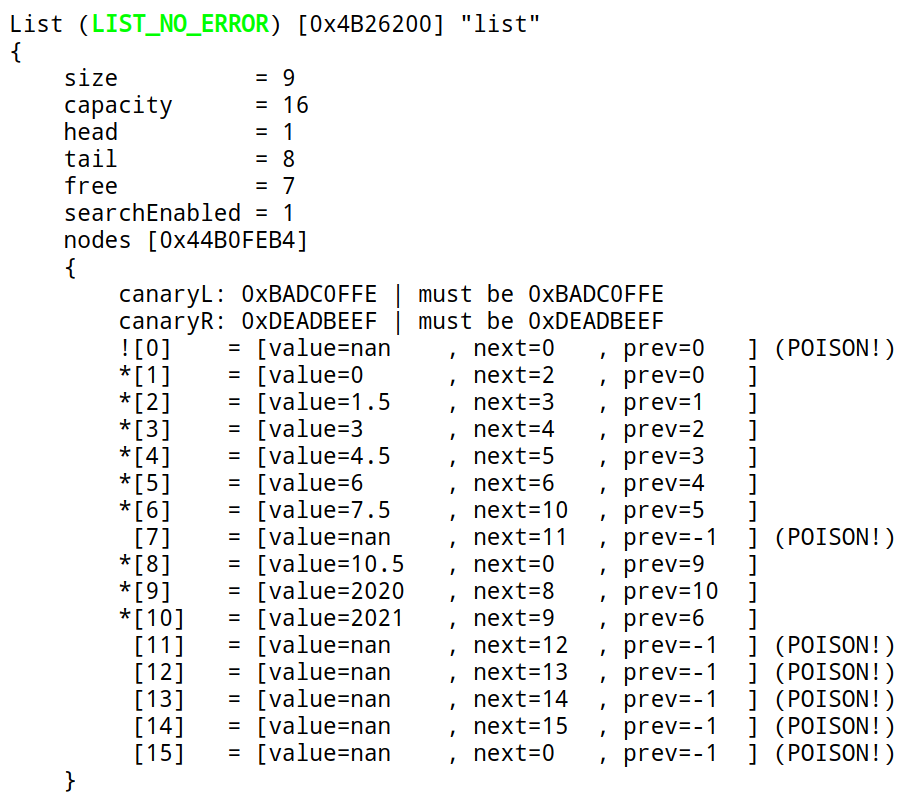
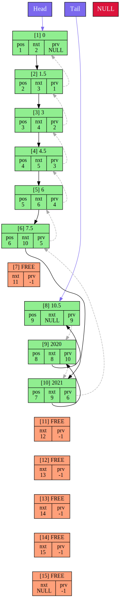

This is my implementation of an indexed linked list. See [documentation]() for the full list of supported operations. Note, that there are so-called *LIST_SLOW* operations, which work in linear time $O(n)$, though can be used once to possibly avoid time-consuming operations in the future (again, see documentation to understand exactly what I mean). 
# Log
Using my [log-generator](https://github.com/tralf-strues/log-generator) and [Graphviz](https://graphviz.org/) list creates log files of the following format:
 
 

Code for which this log file was generated (just random code, don't overthink it :smile_cat:):
```c++
#include "list.h"

const size_t LIST_INITIAL_SIZE = 8;

int main()
{
    List list = {};
    constructList(&list, LIST_INITIAL_SIZE);

    int nineIdx = -1;
    for (size_t i = 0; i < LIST_INITIAL_SIZE; i++)
    {
        if (i * 1.5 == 9) 
        {  
            nineIdx = pushBack(&list, i * 1.5);
        }
        else
        {
            pushBack(&list, i * 1.5);
        }
    }
    
    insertAfter(&list, 2020, nineIdx);
    insertAfter(&list, 2021, nineIdx);
    
    remove(&list, nineIdx);

    dump(&list);
    LG_Close();

    destructList(&list);

    return 0;
}
```